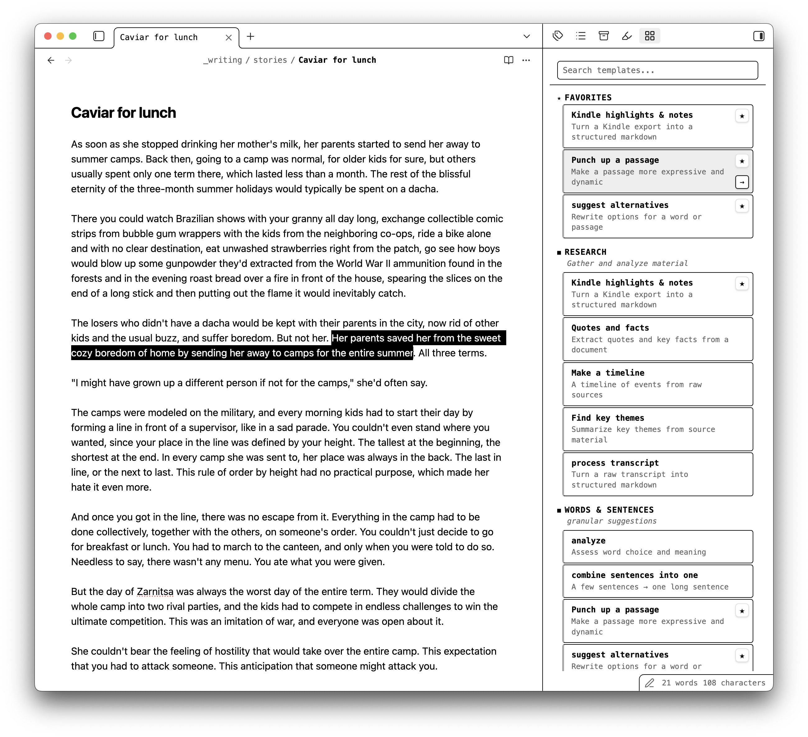

# Grab a Prompt

A library of ready-made AI prompt templates for writers and everyone working with texts, right inside Obsidian (covers literary fiction, genre fiction, non-fiction, copywriting, content marketing, etc.). Pick a template for researching, summarizing, editing, proofing, or brainstorming — it auto-fills with your document or selection and copies to clipboard, ready to paste into ChatGPT, Claude, Gemini, or any LLM.

## How it works

1. Open the **Grab a Prompt** sidebar
2. Browse templates by category or search for one
3. Click a template — it combines the prompt with your current document or selected text
4. Paste the assembled prompt into your AI tool of choice

No typing prompts from scratch. No switching tabs to find that prompt you liked last time.

## Features

- **Curated prompt templates** for research, summarizing, editing, proofing, brainstorming, and more
- **One-click copy** — click a template and the assembled prompt is on your clipboard
- **Auto-fill placeholders** — templates automatically include your full document, current selection, or active paragraph
- **Search and filter** — find the right template instantly across all categories
- **Favorites** — star the templates you use most for quick access
- **Command palette integration** — search templates without leaving the keyboard
- **Works with any LLM** — ChatGPT, Claude, Gemini, or whatever you use
- **Light and dark theme support** — follows your Obsidian theme

## Templates

Templates are curated at [grabaprompt.com](https://grabaprompt.com) and bundled into the plugin at build time. No network calls at runtime.

## Feedback

Found a bug or have a template idea? Open an issue on [GitHub](https://github.com/pishihod2/grabaprompt/issues) or visit [grabaprompt.com](https://grabaprompt.com).
