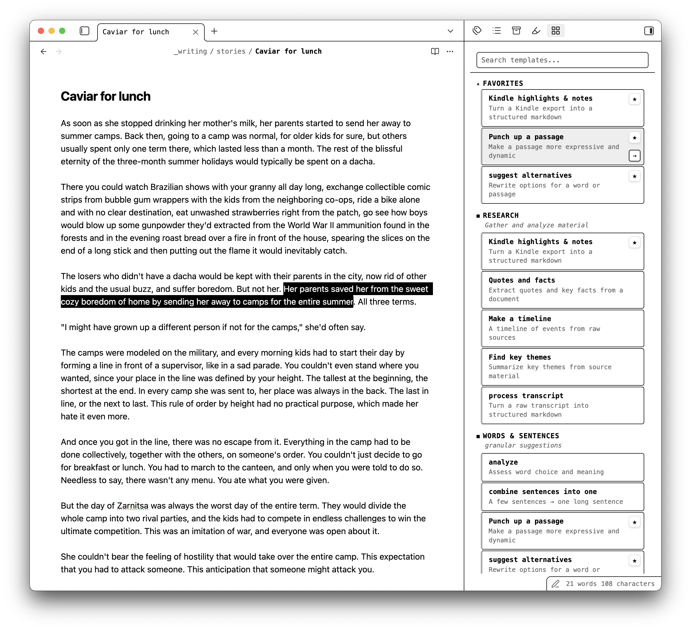

# Grab a Prompt

A library of copy-ready AI prompts for writers and everyone working with texts, right inside Obsidian (literary fiction, genre fiction, non-fiction, copywriting, content marketing). Proofread, edit, summarize, research, or get feedback in the style of famous writers: pick a template, and it auto-fills with your note or selection and copies to clipboard, ready to paste into ChatGPT, Claude, Gemini, or any LLM. No API key and no account needed. Use the AI chat you already have.

## Installation

**From Obsidian (recommended)**

1. Open **Settings → Community plugins** and turn off **Restricted mode** if it's on.
2. Select **Browse**, search for **Grab a Prompt**, and select **Install**.
3. Select **Enable**.

**Manually**

1. Download `main.js`, `manifest.json`, and `styles.css` from the [latest release](https://github.com/pishihod2/obsidian-grab-a-prompt/releases/latest).
2. Put them in a folder named `grab-a-prompt` inside your vault's `.obsidian/plugins/` folder.
3. Reload Obsidian, then enable **Grab a Prompt** under **Settings → Community plugins**.

## Usage

The sidebar opens on the right when the plugin is enabled. To reopen it, select the grid icon in the ribbon or run **Grab a Prompt: Open sidebar** from the command palette.

**Use a template**

1. Open the note you're working on.
2. In the sidebar, browse the categories or search for a template.
3. Click a template to copy the assembled prompt — the template plus your full note — to the clipboard. To preview a template first, hover over it and select the arrow.
4. Paste into ChatGPT, Claude, Gemini, or any other AI tool.

Some templates work on a specific passage. Select text in your note first; those templates are disabled until you do, and the selection is included in the prompt.

**Other ways to prompt**

- **Quick prompt** — type your own instruction in the field at the top of the sidebar and press Enter to copy it together with your note.
- **Selection bubble** — select text in the editor, click the icon that appears next to it, type what the AI should do, and press Enter.
- **Command palette** — run **Grab a Prompt: Browse templates** to search all templates without opening the sidebar.
- **Favorites** — star a template to pin it to the top of the list.
- **My templates** — select **+** in the "My templates" section to save your own prompts. Hover over one to edit or delete it.

The quick prompt, selection bubble, "My templates" section, and built-in templates can each be turned off in **Settings → Grab a Prompt**.

## Features

- **Curated prompt templates** for research, summarizing, editing, proofing, brainstorming, and more
- **One-click copy** — click a template and the assembled prompt is on your clipboard
- **Auto-fill** — templates automatically include your full document, plus your current selection for templates that focus on a specific passage
- **Search and filter** — find the right template instantly across all categories
- **Favorites** — star the templates you use most for quick access
- **Command palette integration** — search templates without leaving the keyboard
- **Works with any LLM** — ChatGPT, Claude, Gemini, or whatever you use
- **Light and dark theme support** — follows your Obsidian theme

## Templates

Templates are curated at [grabaprompt.com](https://grabaprompt.com) and bundled into the plugin at build time. No network calls at runtime.

## Made by icanwrite

Grab a Prompt is made by [icanwrite](https://icanwrite.app), a free Markdown editor for writers that runs AI editing checks like these right inside your drafts — no copy-paste. Feedback comes back as comments in the sidebar, each tied to the passage it refers to, so you can work through them alongside your text. It works with your Obsidian vault.

**Disclosure:** the plugin shows links to icanwrite in its own sidebar (below the template list and under the copy button) and in its settings tab. They are static links bundled with the plugin; nothing is loaded from the network and the plugin collects no data. The links include UTM parameters, so icanwrite.app can see that a visit came from this plugin. You can hide the sidebar links in **Settings → Grab a Prompt → Show icanwrite links**.

## Feedback

Found a bug or have a template idea? Open an issue on [GitHub](https://github.com/pishihod2/obsidian-grab-a-prompt/issues).
